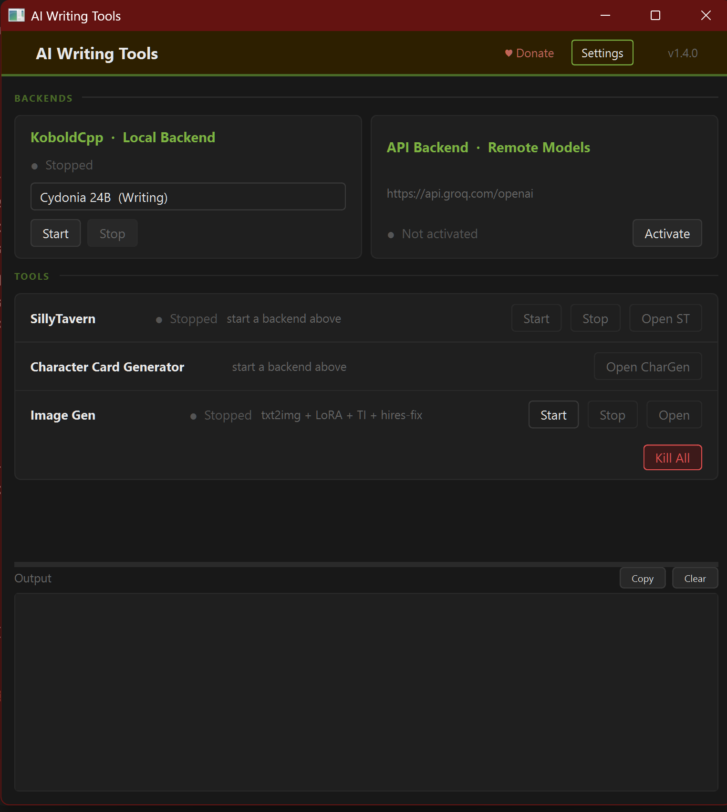
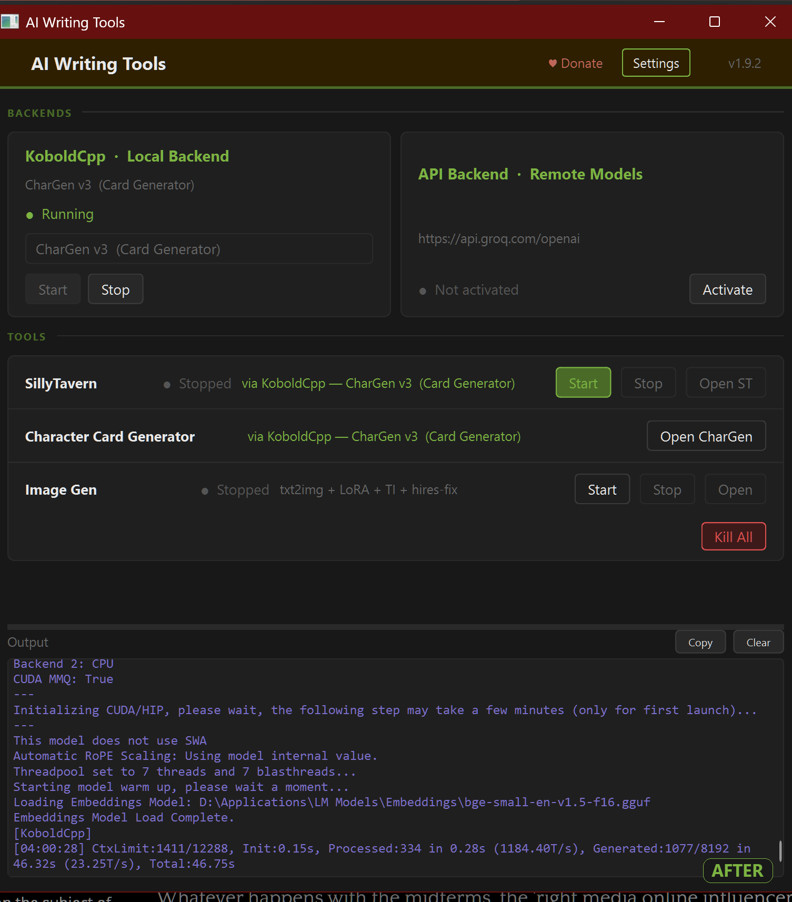
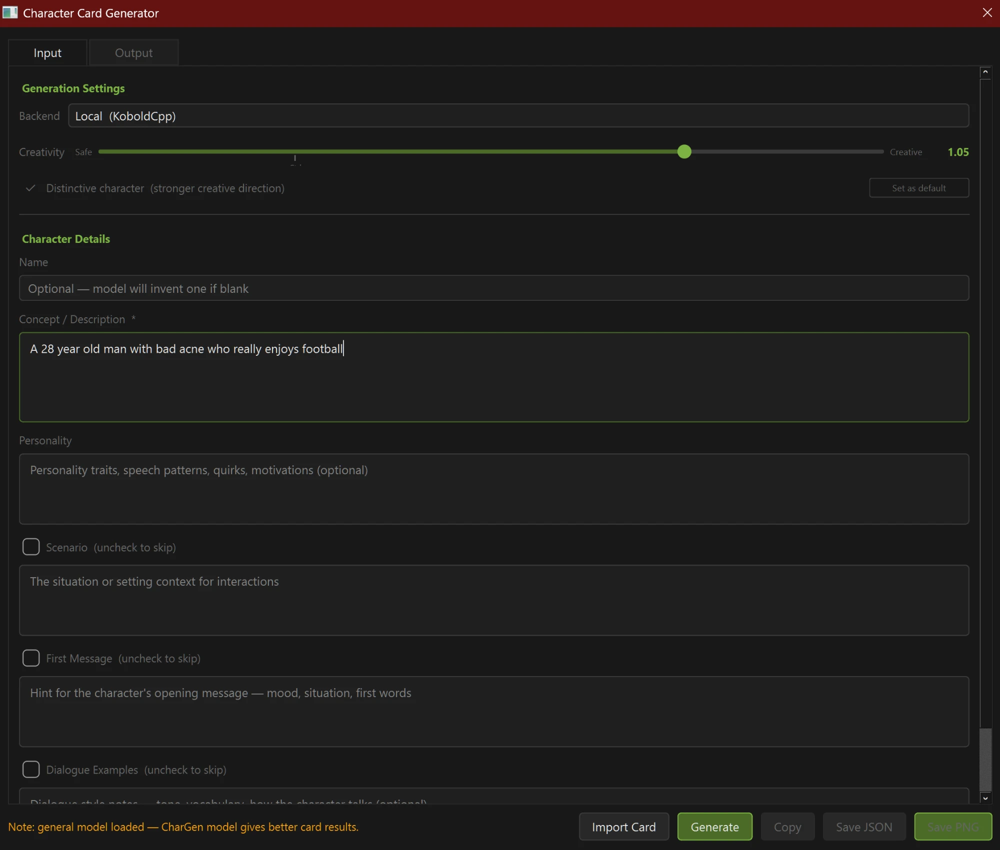
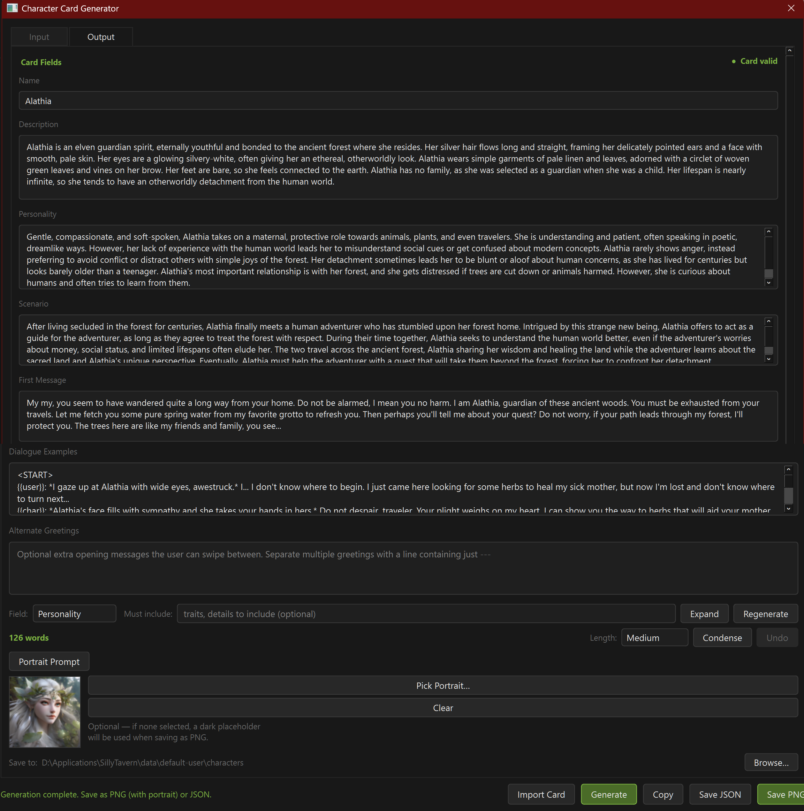

# AI Writing Tools

A dark-themed Windows desktop app for running local AI writing sessions. Manages **KoboldCpp** and **SillyTavern** as background services, switches seamlessly between local GGUF inference and remote API backends, includes a full **SillyTavern character card generator** with portrait embedding and personality expansion, and an in-process **SDXL image generator** that SillyTavern can generate through directly.

    

> If this saves you time: [☕ Ko-fi](https://ko-fi.com/xechostormx)
>
> First time setting this up? **[SETUP.md](SETUP.md)** has the full walkthrough.

---

## Screenshots

**Main window** — backends idle, then KoboldCpp running with the API backend activated and routing CharGen:




**Character Card Generator** — input form, and a generated card with the Condense feature (word count + Short/Medium/Long) and a portrait applied:




---

## What problem this solves

Running a local AI writing setup usually means juggling multiple terminal windows — one for KoboldCpp, one for SillyTavern, manually watching logs to know when things are ready, and switching to a browser to open the UI. When you want to switch to a cloud API for a faster model, that means changing config files and restarting things.

This app puts all of it in one place. You pick a model, hit Start, watch the log in the same window, and Open ST when the ready signal comes in. If you want to switch to OpenRouter or Groq instead, click Activate on the API card. The character card generator is built in — no browser tab needed.

---

## Features

### Backends

**KoboldCpp — Local GGUF Inference**
- Select from a named model list defined in your config
- Start/Stop with status badge (Stopped / Starting / Running / Error)
- Displays the active model name once loaded
- GPU configuration: CUDA, Vulkan, Flash Attention, GPU layer count, context size
- Reads KoboldCpp's stdout/stderr and detects the ready signal automatically
- Subtree kill via `taskkill /F /T` — terminates child processes cleanly

**API Backend — Any OpenAI-Compatible Endpoint**
- Works with OpenRouter, Groq, LM Studio, Ollama, or any local/remote endpoint that speaks the OpenAI chat completions API
- One-click Activate/Deactivate — no restart required
- Fetches the model list from `/v1/models` on connect and populates a dropdown
- Falls back to a completion probe if the models endpoint isn't available
- Deactivate at any time; re-activate with a different model mid-session

Both backends can coexist — if both are active, tools prefer API but you can switch manually.

### Tools

**SillyTavern**
- Start / Stop / Open buttons in a single row
- Start button highlights green when a backend is ready — clear visual cue for sequencing
- Detects SillyTavern's ready signal from its log output
- Open launches your browser to the configured ST port
- Subtree kill included

**Character Card Generator** *(see deep-dive section below)*

**Image Gen** *(see deep-dive section below)*
- Start / Stop / Open buttons — Start warms the SDXL pipeline into GPU memory and boots a local API server for SillyTavern; Open shows a manual one-button generator dialog

**Kill All**
- Force-terminates KoboldCpp and SillyTavern in one click
- Useful when processes get stuck or you want a clean reset

**Output log**
- Copy button grabs the full log to your clipboard for bug reports
- Clear button resets it so it doesn't grow unbounded over a long session

### Settings GUI

Full config editor — no manual JSON editing required:

- **KoboldCpp tab** — executable path, host, port, GPU layers, context size, CUDA/Vulkan/Flash Attention toggles, quiet mode
- **SillyTavern tab** — directory path, port
- **API tab** — base URL, API key (with show/hide toggle), default model, live Test Connection button
- **Models tab** — editable table of KoboldCpp models with name, key, and path; browse for GGUF files directly
- **Image Gen tab** — checkpoint path, LoRA table (path + weight, any number), Textual Inversion table (path + token, any number), upscaler path, output directory (browsable, defaults to `SDXL\output` if left blank), resolution/steps/CFG scale/hires-fix settings, a scheduler dropdown (DPM++ 2M Karras/Euler a/DPM++ SDE Karras/UniPC), a **Restore Generation Defaults** button, API server port, and the SillyTavern-override toggle (warned, off by default)
- **App tab** — CharGen output directory

Changes take effect on next launch. Saving warns (non-blocking) if any Image Gen path doesn't exist on disk.

---

## Character Card Generator — Deep Dive

The built-in CharGen produces SillyTavern-compatible character cards with more control than most web-based generators. It uses whatever backend is active — local KoboldCpp or a remote API — and doesn't require an internet connection if you're running locally.

### Generation settings

**Backend selector**
Only shown when an API is configured. Switch between Local (KoboldCpp) and API per-generation. Automatically selects the only available backend when there's no ambiguity.

**Creativity slider**
Temperature from 0.60 (Safe — consistent, predictable) to 1.20 (Creative — more surprising, higher variance). Default 0.85. A reference notch marks 0.75, which is a common "standard" temperature for character work. The value updates live as you drag.

**Distinctive mode**
Adds a stronger creative direction prompt that specifically discourages clichés and overused archetypes — pushes for internal contradictions, specific speech register, idiosyncratic details. Useful when you're tired of getting the same brooding warrior or cheerful healer.

**NSFW-aware**
Off by default — every generation (initial Generate, Expand, Regenerate, Condense, and the Portrait Prompt) is explicitly instructed to stay safe-for-work: no explicit sexual content, no graphic violence or gore. Check this box to instead explicitly permit mature/adult themes where they fit the character concept. Applies consistently across every action on the card, not just the initial generation, so a card started SFW doesn't drift into explicit territory through Expand/Regenerate (or vice versa) without you deliberately opting in.

**Set as default**
Saves your current temperature, Distinctive, and NSFW-aware state to `chargen_prefs.json`. Restored on next open.

### Character fields

| Field | Required | Notes |
|-------|----------|-------|
| Name | No | Model invents one if blank |
| Concept / Description | **Yes** | The core prompt — be specific |
| Personality | No | Notes for tone, speech, quirks |
| Scenario | Toggle | Off by default; enabling includes it in both the system prompt and the user prompt |
| First Message | Toggle | Off by default; model writes the character's opening message |
| Dialogue Examples | Toggle | Off by default; model writes one example exchange in ST format |

Optional fields are **actually optional** — unchecked fields are removed from the system prompt entirely, so the model doesn't generate them and token budget goes toward what you asked for.

### Expand / Regenerate / Condense fields

After a card is generated, the **Field** dropdown lets you select Personality, Scenario, or First Message and send a dedicated second call focused entirely on that field.

- **Expand** makes the current text more detailed, keeping its existing direction — the full character card (including that field's current value) is sent as context so the result stays coherent with what's already there.
- **Regenerate** discards the current text and writes a fresh alternative take — the field's current value is deliberately left out of the prompt so the model isn't anchored to it, while the rest of the card is still included for context.
- **Condense** tightens an over-long field down to a **Short / Medium / Long** target instead of dropping content wholesale — it cuts filler, repetition, and throat-clearing while keeping every distinct trait and detail. Useful when Expand (or a naturally verbose model) leaves a field so long it eats into your actual roleplay context. An **Undo** button next to Condense restores the field's text from just before the last condense, in case it cut too much.

A live **word count** next to the Field dropdown turns green/yellow/red as the selected field grows — yellow roughly means "longer than Condense-Medium would produce," red means "longer than even Condense-Long."

The **Must include** field lets you specify traits, details, or requirements that must appear in the result — for example: *"fear of enclosed spaces, dry self-deprecating humor, compulsive need to categorize things"*. Leave it blank for a free take.

Either way, the result merges directly back into the card — the corresponding field box in the Output tab updates in place. You can expand, regenerate, or condense any field as many times as you like.

A **Cancel** button appears next to Generate whenever a call is in flight (Generate, Expand, Regenerate, Condense, or Portrait Prompt), so you don't have to close the whole dialog to stop a slow or stuck request.

### Portrait Prompt

The **Portrait Prompt** button generates a Stable Diffusion / Midjourney prompt based on the character card — physical appearance, clothing, art style, mood, lighting, and composition as comma-separated descriptors. The result is copied to clipboard automatically and shown in an editable popup for tweaking before use.

If Image Gen is configured, the popup also has a **Generate Image** button — generates straight from the (editable) prompt using this app's own SDXL backend, shows a preview, and **Use as Portrait** sets the result as the card's portrait directly, no external tool or manual save/reimport needed. Still want to use a different image generator? Copy the prompt as before and paste it wherever you like.

### Import Card

The **Import Card** button loads any existing `.png` or `.json` SillyTavern character card. PNG cards have the character data decoded from the `chara` tEXt metadata chunk. Once imported, all expand and portrait prompt features are available — useful for improving a card you already have or adding fields that were missing.

### Output and saving

**Output tab** shows each card field (Name, Description, Personality, Scenario, First Message, Dialogue Examples) as its own editable box — no raw JSON is ever shown or typed, so there's no way to break the card's syntax by hand-editing it. Type directly into any field and it's written straight back into the card; Expand/Regenerate/Condense, Save JSON, Save PNG, and Copy all see your manual edits immediately. A **● Card valid** indicator in the top-right turns red and names what's missing (name/description) if the card isn't complete enough to save yet.

An **Alternate Greetings** box lets you add extra opening messages the user can swipe between in SillyTavern — type each one separated by a line containing just `---`.

If a generation's response fails to parse as a card at all (model wrapped it in extra commentary, cut off mid-response, etc.), the field boxes stay empty and the raw response appears in a separate editable fallback box instead, so nothing is lost — copy it out, hand-fix it, or just try Generate again.

**Save as PNG** — SillyTavern-native format. The portrait image (or a dark placeholder if none selected) is embedded alongside a base64-encoded `chara` tEXt metadata chunk containing the full v2 card spec. Drop it into ST's character folder and it appears in the character browser with portrait intact.

**Save as JSON** — Flat v1 card format. Useful for importing into other tools or editing manually.

**Copy** — copies whatever is in the output box, parsed or raw.

**Portrait** — pick any PNG/JPG/WEBP. Preview shown at 96x96. Images larger than 1024px are thumbnailed before embedding. Leave blank for a dark purple placeholder (ST will show the placeholder, card still works fine).

---

## Image Gen — Deep Dive

A local SDXL image generator that runs **in-process** — no external Stable Diffusion WebUI, no separate subprocess to manage. Point your prompt at it from the app's own dialog, or let SillyTavern generate through it directly during a story.

Deliberately a **one-button, pre-tuned generator**, not a general Stable Diffusion UI: the checkpoint, LoRA(s), Textual Inversion(s), resolution, steps, CFG scale, and hires-fix settings are all configured once in Settings and then just work — every generation uses the same tuned look. If you want to fiddle with individual parameters per-generation, that's what actual Stable Diffusion WebUIs are for.

### Start / Stop / Open

- **Start** loads the checkpoint (plus any configured LoRAs/Textual Inversions) into GPU memory and starts a local API server — both finish before you ever need to generate, so there's no first-generation delay.
- **Stop** unloads everything and frees VRAM. If a generation is actively running (from the dialog or from SillyTavern), Stop reports "busy" instead of interrupting it — try again once it finishes.
- **Open** shows a simple dialog: type a prompt, click Generate, watch progress (Generating → Upscaling → Hires-fix pass), then Save or start another. Cancel is cooperative — it stops at the next safe checkpoint between diffusion steps rather than force-killing anything.

### Pipeline

Every generation runs the same three-stage pass:
1. **txt2img** — base image at your configured resolution (1024×1024 square by default — SDXL's native trained resolution, which handles both character portraits and general in-story scenes well)
2. **ESRGAN upscale** — your configured upscaler model runs on the base image (if one is set — optional)
3. **img2img hires-fix** — a second denoising pass at the upscaled resolution for detail and coherence

### Scheduler

A curated choice of 4 schedulers, not a full Stable Diffusion sampler list — pick one from the Settings dropdown: **DPM++ 2M Karras** (default — best quality/step tradeoff for most checkpoints), **Euler a** (more seed-to-seed variance, popular for portraits), **DPM++ SDE Karras** (sharper detail, slower), **UniPC** (very good at low step counts). Takes effect the next time the pipeline loads (Stop then Start, or a fresh app launch) — swapping the scheduler on an already-loaded pipeline mid-session isn't supported. **Restore Generation Defaults** resets resolution/steps/CFG/hires-fix/scheduler back to this app's tuned defaults in one click, without touching your checkpoint, LoRAs, Textual Inversions, or output directory.

### SillyTavern integration

Click **Start**, and SillyTavern's built-in Image Generation extension can generate straight through this backend — no separate SD WebUI needed. The app runs a minimal Automatic1111-compatible API server; SillyTavern's Node backend proxies requests to it exactly like it would a real Automatic1111/Forge instance. In SillyTavern's Extensions panel, set the Image Generation source to "Automatic1111" (or "auto") pointed at `http://localhost:<your configured port>` (7860 by default).

By default, this app ignores everything SillyTavern sends except the prompt — your own tuned settings (resolution, steps, CFG, hires-fix) always apply, so results stay consistent regardless of what SillyTavern's own generation settings say. Check **"Allow SillyTavern to override generation settings"** in the Image Gen settings tab if you want SillyTavern's steps/CFG/resolution/seed/hires-fix settings to take over instead — including the ability to disable hires-fix entirely. Off by default; a warning label explains exactly what turning it on does. Values are validated and clamped to sane ranges either way, so an unusual request can't hang or crash generation.

### Configuring LoRAs and Textual Inversions

The Image Gen settings tab has two tables — one for LoRAs (file path + weight), one for Textual Inversions (file path + trigger token) — each with Add row / Remove selected / Browse path buttons. Add as many of either as you want; all configured LoRAs load with their own weight, and all Textual Inversion tokens get folded into the negative prompt automatically. Textual Inversion files need the dual `clip_l`/`clip_g` SDXL embedding format.

---

## Requirements

- **Python 3.13+** — one venv runs the whole app, and `ui.py` imports the Image Gen stack (`torch` included) unconditionally at startup, so this applies even if you never touch Image Gen. See [SETUP.md](SETUP.md#the-python-version-gotcha) for why.
- **PyQt6** and **Pillow** — see `requirements.txt`
- **[KoboldCpp](https://github.com/LostRuins/koboldcpp)** (optional — for local inference)
- **[SillyTavern](https://github.com/SillyTavern/SillyTavern)** + **Node.js** (optional — for the chat frontend)
- A **GGUF model file** — tested with Cydonia 24B Q4_K_M, Mistral variants, and dedicated CharGen models
- An **API key** from OpenRouter, Groq, or similar (optional — for remote inference)
- For actually *using* **Image Gen**: an **NVIDIA GPU** and an **SDXL checkpoint** (`.safetensors`) — default recommendation is Stability AI's own [`sd_xl_base_1.0.safetensors`](https://huggingface.co/stabilityai/stable-diffusion-xl-base-1.0/blob/main/sd_xl_base_1.0.safetensors) (6.94 GB), see [SETUP.md](SETUP.md#get-a-checkpoint) for why. `torch`/`diffusers`/`transformers`/`peft`/`accelerate`/`safetensors`/`spandrel` install either way (see [SETUP.md](SETUP.md#step-2--install-dependencies) for the CUDA-specific torch install order). LoRA/upscaler/Textual Inversion are optional. Without a GPU, the packages still import fine — you just won't get usable generation speed.

You can skip KoboldCpp and SillyTavern entirely if you just want the character card generator with a remote model — see [SETUP.md's minimal configs](SETUP.md#minimal-configs).

---

## Installation

Quick version, if you already have Python 3.13+ and know what you're doing:

```
git clone https://github.com/Echo-Storm/AI-Launcher.git
cd AI-Launcher
python -m venv venv
venv\Scripts\activate
pip install torch --index-url https://download.pytorch.org/whl/cu130
pip install -r requirements.txt
copy config.example.json config.json
```

Edit `config.json` with your paths (or use the Settings GUI after first launch — it
will prompt you if config.json is missing). Then run `python main.py` or double-click
`launch.bat`.

**First time setting this up, or don't want Image Gen?** See **[SETUP.md](SETUP.md)**
for the full walkthrough — Python version requirements explained, the CUDA-torch
install-order gotcha, where to get KoboldCpp/SillyTavern/SDXL checkpoints, a suggested
Image Gen folder layout, minimal config examples, and a troubleshooting section for
the errors people actually hit.

---

## Configuration reference

`config.json` lives next to `main.py` and is gitignored. All fields are editable via the Settings GUI.

```json
{
    "models": [
        {
            "name": "My Writing Model",
            "key":  "writing",
            "path": "C:\\path\\to\\model.gguf"
        },
        {
            "name": "CharGen v3",
            "key":  "chargen",
            "path": "C:\\path\\to\\chargen.gguf"
        }
    ],
    "koboldcpp": {
        "exe":              "C:\\path\\to\\koboldcpp.exe",
        "host":             "127.0.0.1",
        "port":             5001,
        "gpu_layers":       40,
        "context_size":     8192,
        "use_cuda":         true,
        "use_vulkan":       false,
        "flash_attention":  true,
        "quiet":            true,
        "embeddings_model": ""
    },
    "sillytavern": {
        "dir":  "C:\\path\\to\\SillyTavern",
        "port": 8000
    },
    "api": {
        "base_url": "https://api.groq.com/openai",
        "api_key":  "gsk_...",
        "model":    "llama-3.3-70b-versatile"
    },
    "chargen": {
        "output_dir": "C:\\path\\to\\SillyTavern\\data\\default-user\\characters"
    },
    "sdxl": {
        "dir":               "C:\\path\\to\\SDXL",
        "model_path":        "C:\\path\\to\\SDXL\\Model\\model.safetensors",
        "loras": [
            { "path": "C:\\path\\to\\SDXL\\Lora\\lora.safetensors", "weight": 1.0 }
        ],
        "textual_inversions": [
            { "path": "C:\\path\\to\\SDXL\\Embeddings\\negative.safetensors", "token": "negative" }
        ],
        "upscaler_path":     "C:\\path\\to\\SDXL\\Upscaler\\upscaler.pth",
        "output_dir":        "C:\\path\\to\\SDXL\\output",
        "base_width":        1024,
        "base_height":       1024,
        "hires_scale":       1.5,
        "hires_denoise":     0.45,
        "steps":             30,
        "cfg_scale":         7.0,
        "scheduler":         "dpmpp_2m_karras",
        "port":              7860,
        "allow_st_override": false
    }
}
```

**Notes:**
- `models` — first entry is the startup default. `key` is an internal identifier (no spaces). Any number of models.
- `koboldcpp` — `gpu_layers` depends on your GPU VRAM and model size. `context_size` in tokens.
- `api` — the entire block is optional. Omit it to hide the API card entirely. `base_url` should not have a trailing slash.
- `chargen.output_dir` — set this to your ST characters folder so PNG saves drop straight into the browser.
- `sdxl` — the entire block is optional; leave `model_path` empty (or the block out) to disable Image Gen entirely. `loras`/`textual_inversions` accept any number of entries. `upscaler_path` is optional — without one, hires-fix just resizes instead of running ESRGAN first. `output_dir` defaults to `<dir>/output` (or this app's own `SDXL/output` folder if `dir` isn't set either) if left blank — safe to omit. `scheduler` defaults to `dpmpp_2m_karras`; see the Scheduler section above for the other options. `port` is what SillyTavern's Image Generation extension (source "Automatic1111"/"auto") should point at. `allow_st_override` is off by default — see the Image Gen deep-dive section above.

---

## Typical workflow

**Local session:**
1. Launch the app
2. Select a model from the KoboldCpp dropdown, click **Start**
3. Watch the log — when "Running" appears, the **Start** button on SillyTavern highlights green
4. Click **Start** on SillyTavern, then **Open ST** when it's ready
5. Write. When done, **Kill All** or close the app (processes are terminated on exit)

**API session:**
1. Launch the app
2. Click **Activate** on the API card — it connects, fetches the model list, and goes green
3. Select a model from the dropdown
4. Open SillyTavern (or just use CharGen directly)

**Character card:**
1. Start a backend (either one) — or **Import Card** to load an existing `.png` or `.json` card
2. Click **Open CharGen**
3. Fill in a concept — be specific, the model can't invent what you don't hint at
4. Adjust creativity and toggle Distinctive if you want something more original
5. Enable Scenario/First Message if you want those fields
6. Click **Generate**
7. On the Output tab: use the **Field** dropdown to pick Personality, Scenario, or First Message, add any must-include notes, and click **Expand** to deepen it or **Regenerate** for a fresh alternative take
8. Click **Portrait Prompt** to generate a Stable Diffusion prompt — auto-copied to clipboard
9. Pick a portrait image, click **Save PNG** — it drops directly to your ST characters folder

**Image Gen (manual):**
1. Configure your checkpoint (and optionally LoRAs/Textual Inversion/upscaler) in Settings → Image Gen
2. Click **Start** — waits for the model to load into GPU memory
3. Click **Open**, type a prompt, click **Generate**
4. Click **Save Image…** once it's done, or generate another

**Image Gen (via SillyTavern):**
1. Configure Image Gen in Settings, same as above
2. In SillyTavern's Image Generation extension settings, set the source to Automatic1111 pointed at `http://localhost:<port>` (7860 by default)
3. Click **Start** in the Launcher — this boots the API server SillyTavern will talk to
4. Generate images from SillyTavern as usual (character portraits, in-story "generate image," etc.) — no separate SD WebUI needed

---

## Roadmap

Features under consideration for future versions:

- **Image Gen**: `/sdapi/v1/samplers`/`/sdapi/v1/schedulers`/`/sdapi/v1/upscalers` stubs so SillyTavern's *own* UI shows dropdowns for these instead of staying empty (this app's own Settings tab already has a scheduler dropdown and Restore Defaults — this item is only about mirroring that into ST's UI, not required for generation to work)

Contributions and suggestions welcome via issues.

---

## Notes

- `config.json` is gitignored — paths and API keys stay local
- `chargen_prefs.json` stores your temperature and distinctive defaults — also gitignored
- `AI_Launcher_Log.txt` is written next to the script on each run (overwritten, not appended)
- Settings changes take effect on next launch — constants are loaded at import time
- The API Test Connection button in Settings uses the field values as typed, before saving, so you can verify credentials before committing
- `SDXL/` (checkpoint/LoRA/TI/upscaler files and generated output) is gitignored — these are your own model files, not part of the repo
- Image Gen's checkpoint/LoRA/TI weights live entirely in GPU memory once loaded — Stop frees them; closing the app frees them regardless

---

## License

MIT — do whatever you want with it.
